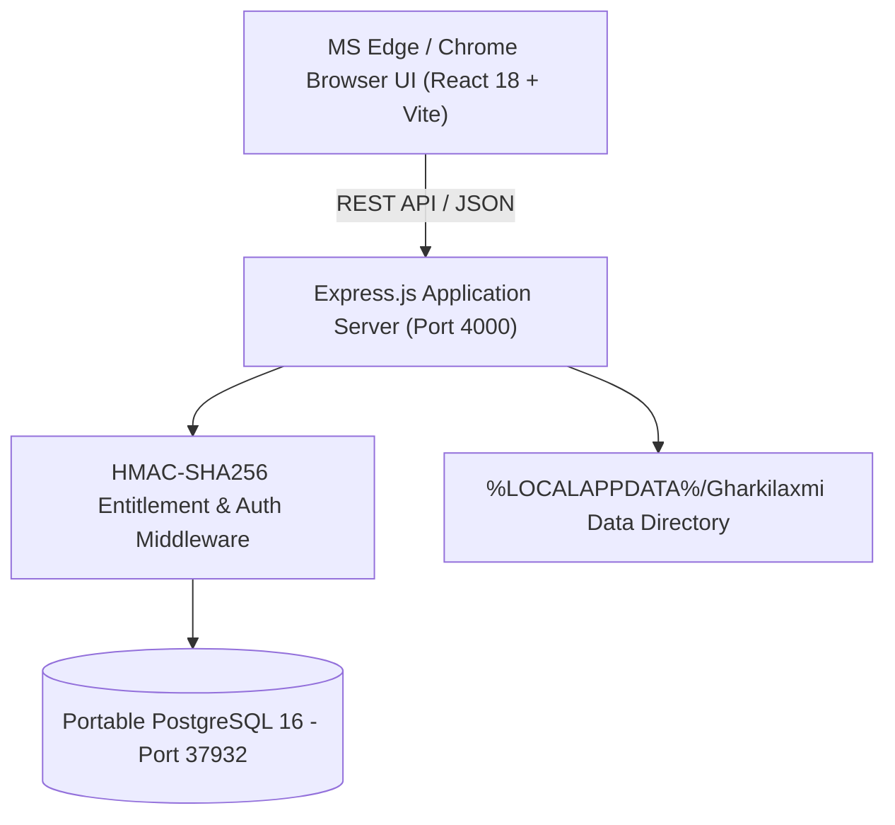

# 🪷 Gharkilaxmi Enterprise (`v4.0.0`)

> **India's First Privacy-Conscious Personal & Family Wealth Intelligence Platform**  
> *100% Local Data Architecture, Offline CAMS Statement Parsing, Portfolio Intelligence, and Governed Wealth Workflows.*

---

## 📦 Windows Release Build (`v4.0.0`)

* 💾 **Installer Download**: [**`Gharkilaxmi_v4.0.0_Setup.exe`**](https://github.com/drijayakumar/ghar-ki-lakshmi-public/releases/download/v4.0.0/Gharkilaxmi_v4.0.0_Setup.exe)
* 🔐 **SHA-256 Checksum**: `52B0E91015E4BDA13BBA35E3C765D7DAD083B0F3BA845FD52675F86AFDC40756`
* 🖥️ **Supported OS**: Windows 10 & Windows 11 (64-bit)
* ⚡ **Zero Setup Prerequisites**: Bundles isolated portable PostgreSQL 16 (port `37932`) and Node.js v24.

*Note: As a freshly compiled unsigned installer, Windows SmartScreen may present a standard prompt on first run. Click **"More Info" -> "Run Anyway"** to proceed with installation.*

---

## 🛡️ Privacy & Local Data Architecture

Gharkilaxmi is built from the ground up to respect financial privacy:

* **🔒 100% Local Storage**: All financial ledgers, asset records, liabilities, family accounts, and transaction logs reside in `%LOCALAPPDATA%\Gharkilaxmi` on your local disk.
* **🚫 Zero Telemetry & Tracking**: No background analytics, no phone-home user tracking, and no external data aggregation.
* **📄 Offline Statement Ingestion**: Parse CAMS / MF Central CAS statements, PPF passbook PDFs, and bank CSV exports locally without uploading financial data to external servers.
* **🌐 Opt-In External APIs**: Real-time asset prices (Yahoo Finance / IBJA) and AI Wealth Insights run **only when explicitly requested by you**.
* **🏛️ Live Bank Synchronization (Account Aggregator)**: Currently disabled pending regulatory FIU registration approval. Users can import financial data via offline CAMS/MF Central CAS statements and passbook PDFs.

---

## ✨ Key Platform Features

### 1. 💰 Asset & Portfolio Tracking
* Comprehensive tracking across Indian asset classes: Mutual Funds, Indian Equities, Fixed Deposits, PPF, Real Estate, Physical Gold, Bank Balances, and NPS.
* Multi-currency conversion, portfolio cost basis tracking, and real-time net worth calculation.

### 2. 📜 Offline CAMS & Statement Ingestion
* Import CAMS and MF Central Consolidated Account Statements (CAS) with OTP validation or local PDF parsing.
* Parse bank passbooks and CSV statements directly into structured transaction categories.

### 3. 📊 Tax & Capital Gains Studio
* India-first tax planning engine evaluating Short-Term Capital Gains (STCG) and Long-Term Capital Gains (LTCG) under relevant Income Tax regimes.
* Tax harvesting opportunity discovery and tax-ready summary reports.

### 4. 🧭 Wealth Intelligence Studio
* Governed wealth workflows for Financial Plans, Portfolio Rebalancing Simulations, Client Onboarding Packs, and Family Office reports.

### 5. ✨ AI Wealth Insights
* Local balance sheet analysis delivering personalized health scores, portfolio risk alerts, and high-impact financial actions.

### 6. 🔐 Trust & Security Center
* Encrypted local data storage, multi-factor authentication (MFA/TOTP), audit log history, and one-click JSON/CSV data backup & restore.

---

## 🔑 Licensing & Evaluation Model

Gharkilaxmi provides a flexible evaluation and licensing model:

| Evaluation / Licensing Tier | Capabilities & Scope |
| :--- | :--- |
| **⏳ 14-Day Full Evaluation** | **100% Full Access** to all core ledger creation, editing, asset entry, CSV/CAS import, and transaction features for 14 days post-installation. |
| **🔒 Post 14-Day Read-Only Mode** | Unlicensed installations enter Read-Only Mode after Day 14. Data viewing and JSON/CSV backup exports stay **100% free and functional forever**. Mutation requests (`POST`, `PUT`, `DELETE`) return `HTTP 403 Read-Only Mode`. |
| **🔑 Registered Copy (`GK-ACCESS-`)** | Unlocks full lifetime data creation/editing capabilities + **AI Wealth Insights** & **Wealth Intelligence Studio**. |
| **🔑 Connection Add-On (`GK-CONNECTION-`)** | Entitlement for External Connections & Bank Account Aggregator (AA) links (*Note: Live AA bank sync is currently disabled pending regulatory FIU registration approval; use offline CAMS CAS / PDF import*). |
| **🔑 Dual License (`GK-DUAL-`)** | Unlocks all Access and Connection capabilities in a single unified key (*Live AA sync disabled pending FIU registration approval*). |

---

## 🛠️ Architecture & Tech Stack



* **Frontend**: React 18, Vite, React Router v6, Recharts, Lucide Icons, Outfit & Playfair Display Typography.
* **Backend**: Node.js v24, Express.js, PostgreSQL 16 (Knex.js / Objection.js ORM), Obfuscated JavaScript Runtime.
* **Installer**: Inno Setup 6 compiler with pre-install taskkill hooks and automated PostgreSQL initialization.

---

## 🚀 Local Development Setup

### Prerequisites
* **Node.js**: v18+ or v24
* **PostgreSQL**: v14+ (or bundled portable PostgreSQL)

### 1. Clone Repository
```bash
git clone https://github.com/drijayakumar/Wealth-Wise.git
cd Wealth-Wise
```

### 2. Install & Run Backend
```bash
cd backend
npm install
npm run dev
```

### 3. Install & Run Frontend
```bash
cd ../frontend
npm install
npm run dev
```
Open `http://localhost:5173` (Vite dev) or `http://localhost:4000` (Express production build).

---

## 📄 License & Terms

Copyright (c) 2026 Gharkilaxmi Enterprise. **All Rights Reserved.**  
Use of this software is subject to the **Gharkilaxmi End User License Agreement (EULA)**. See [`LICENSE`](file:///c:/Users/Jayak/Projects/Gharkilakshmi/LICENSE) for details.
